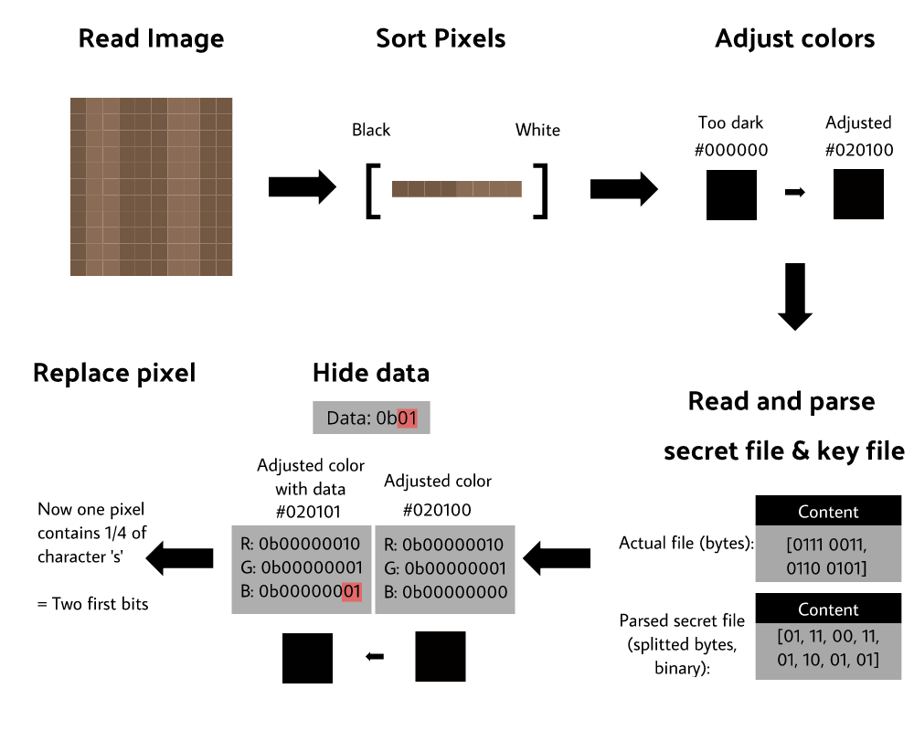

# Design Document

The purpose of this Node.js application is to hide small amount of data (relative to the image) inside a PNG file. Data can be extracted from the manipulated image using the same key that was used to encrypt the message.

## Algorithms and Data Structures

The application utilizes merge sort to sort individual pixels based on their RGB sum (R + G + B). Merge sort was selected since it is generic O(log(n)) sorting algorithm. Sorted pixels will be stored in a double-ended queue which provides fast access to both ends of the queue. This is necessary since we manipulate pixels at both ends. The side of the queue we select is dependent of the user's key. Based on previous algorithms, space complexity will be O(n).

## Input and Output

### Hiding data

There will be 3 required parameters and 1 optional parameter:

```bash
# -i => path to PNG image
# -f => path to file that will be hidden in image
# -k => path to key file
# -o => name of the generated PNG file (defaul: 'out.png') *OPTIONAL*

# Example
npm start -- -i ~/Desktop/cat.png -f ../text.txt -k ../key.txt -o secret-cat.png
```

### Extracting data

There will be 4 required parameters:

```bash
# -e => for extraction
# -i => path to PNG image
# -k => path to key file
# -o => name of the generated file

# Example
npm start -- -e -i ~/Desktop/secret-cat.png -k ../key.txt -o secret.txt
```

## Illustration

Simplified picture how data hiding will work



## Sources

[Steganography](https://en.wikipedia.org/wiki/Steganography) <br/>
[Merge sort](https://en.wikipedia.org/wiki/Merge_sort) <br/>
[Double-ended queue](https://en.wikipedia.org/wiki/Double-ended_queue) <br/>
[Stack](<https://en.wikipedia.org/wiki/Stack_(abstract_data_type)>)<br/>
