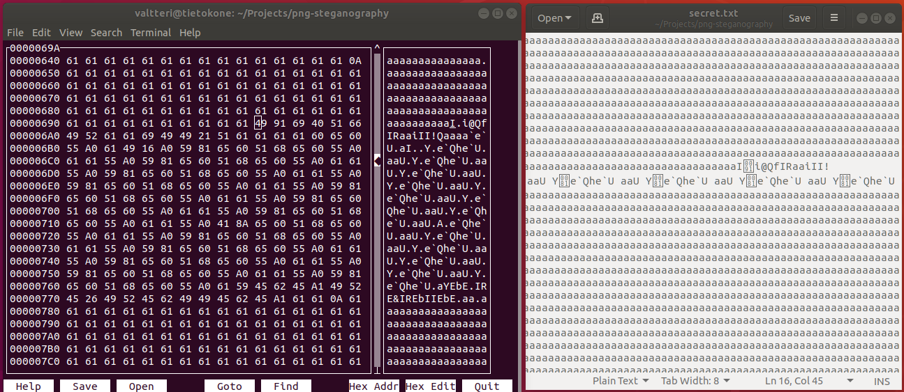

# Week 2

[Hour reporting](./hours.md)

## What happened in week 2

- Command-line interface + command line parameters
- Implementing core functionality of the program:
  - Hiding data in image
  - Extracting data from image

* Created tests for pixel and parser
* Cleaned and refactored code
* Added JSDoc and documented code

To generate the docs run `npm install && npm run generate-docs`. 
The docs are generated to docs/api and to view them open index.html with your browser.

## Testing

I went already well over the 15-20h week pace so I did not write any tests for image.js.

## Problems

There is a bug in data hiding or extracting. I think it is either in pixel.js or in image.js. I hid a file full of character a's in the image. Part of the data got corrupted in the hiding process or in the extracting process.

## What did I learn

- Learned to like test-driven development
- A bit of bit manipulation

When I rewrote parsers I wrote the tests before rewriting the parsers. It was so nice to have immediate feedback whether my code was working or not. Though it requires a good planning.

## How the app works?

I was asked to explain in detail how the app works so here's the detailed version how hiding data inside the image works. There's also a quick overview of data extraction process.

### Simplified data hiding process

### Reading the image

At first the image data is stored in pngjs but very soon every pixel is parsed into an array of Pixel objects. Those Pixels are then sorted based on their RGB sum and their x, y coordinate. Merge sort will be used to sort the array. I will use sorting so that data will be spread across the image. In specific I implement and use merge sort for this phase. Once the Pixels are sorted it is time to move them into Deque. Deque will be used since it provides fast access to both ends which is necessary when we hide and extract the data. It will be clear why I use Deque when I explain data hiding process.

### Color adjusting

Every pixel is now a Pixel object which contains info about its RGBA color as well as its location. In order to hide data inside the blue color we must be sure that it will not change the order of the Pixels. Otherwise extracting the data from the image will be impossible since we dont get the same order when we sort it. That's why we must adjust the color so that we can certainly balance the change in color blue. In order to do that we make sure that sum of red and green is x <= red + green <= 255-x where x = maximum bits of data. If we reserve 2 bits for the data the maximum bits of data is 0b11 or 3. Now we now that red + green should be equal or greater than 3. So now we need to make sure it is greater than 3 so if the data happens to be 0b11 RGB sum will be the same even after we increase the color blue. So now we loop through every Pixel and if the Pixel is too dark or light we adjust it.

### Reading the secret file

I assume when the user writes the text file it will be in utf-8. So every character will be 8-bit integer. However we have a problem. If the maximum bits of data is 0b11 and our character is 8-bit or maximum of 255. So in this case we need to split the byte into smaller 2-bit pieces. If the maximum bits of data is 0b1111 we need to split it into 2 4-bit pieces. In the first scenario we convert 0b11001100 into [0b11, 0b00, 0b11, 0b11]. This is what byteParser.js will do. It parses our utf-8 encoded file into a array of 2-bit integers that we can hide inside the individual Pixels. There is however another problem which appears when we extract the data: when we stop extracting? Currently the extracting will stop when it extracts a byte 0xFF which is not a valid UTF-8 character. Significantly better solution is that we ex. 2-byte integer that indicates the length of the content. I'm planning to change the method to the latter if there's time.

### Reading the key file

The same principal applies but now we parse the data to 1-bit integers: 0 or 1. For example if the encryption key file contains only character 'a' or in binary 0b01100001 it would parse it to [0, 1, 1, 0, 0, 0, 0, 1].

### Data hiding

Now we have 2 different arrays which contain our data and key and 1 deque which contains our Pixels. Now we start reading the parsed key file. If it contains 0 we shift the deque so that we remove the first item from it. If it contains 1 we pop the deque so that we remove the last item from it. Either way we end up with a Pixel. Then we use Pixel's hideData method to hide the data (see [pixel.js](../src/image/pixel.js)) and balance the addition so that the RGB sum will remain the same. Then we use Image's replacePixel method to replace PNG's RGB value with the Pixel's values. We repeat this process untill all data is hidden.

### Data extraction

Image is read like in the data hiding part but the Pixels are not adjusted (we do not hide any data, no need to). We sort the Pixels and with the parsed key shift/pop the Pixel but instead of hiding data we extract it. So if the color blue is 0b01010101 and we use maximum value of 0b11 in our data bits, the extracted data is 0b01010101 & 0b11 = 0b01. We repeat that until all the hidden bits are extracted. Then with byteParser we combine them to bytes.

## Questions

Last week I got feedback that my project is not large enough and I should code my own PNG parser from scratch. I think coding the PNG parser alone should be a project of its own since there's even data compression to handle. I could use every week 30+ hours but it goes well beyond 4 credit.

1. If I implement 2-3 datasctructures and 1 sorting algorithm + all the other logic in this application can I use [pngjs](https://github.com/lukeapage/pngjs) to extract RGB value? If not can you suggest some addition to this project so that it matches the requirements?

## Next week

- A lot of bug fixing
- Writing tests to image.js and pixel.js
